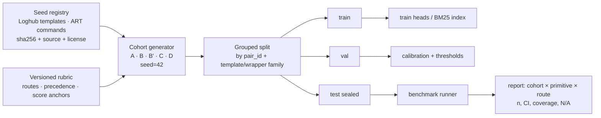

# v2 dataset sources and test structure (plan)

Status: **Draft / proposed — not implemented, not measured.** Companion to `docs/BLUEPRINT_V2.md` (branch `feat/finite-json-calibration`), which already fixes the 500-case pilot, the four cohorts, the five v2 routes and the boundary-label caveat. This file decides *where seeds come from*, *what each cohort must contain to be a fair test*, and *how work is split so it can run in parallel*.

## 1. Seed sources — verification status (checked 2026-09-30)

| Source | Verified here | License / terms | What it actually provides | Decision |
| --- | --- | --- | --- | --- |
| Loghub (`logpai/loghub`) | ✅ cloned | "Freely available for research or academic work"; any use or distribution must reference the repo URL and cite the paper | Per-system `*_2k.log`, `*_structured.csv`, `*_templates.csv` in-repo (OpenSSH 27, OpenStack 43, BGL 120, HDFS 14, Linux 118 templates). Full logs on Zenodo. Only BGL/HDFS/OpenStack carry anomaly labels (normal/anomaly), not route/score. | **Use templates only** (`<*>` placeholders), filled with synthetic entities. Do not vendor raw `.log` lines: OpenSSH samples contain real public IPs and usernames (AGENTS.md rule 4). License scope is limited — see §1a. |
| OpenEnv SRE triage (`DarDrax/incident-triage-env`, HF) | ❌ huggingface.co blocked by this environment's egress policy | Unverified | Unverified | **Excluded until verified** on a host with HF access (existence, license, content). Not a dependency of the pilot. |
| Atomic Red Team (`redcanaryco/atomic-red-team`) | ✅ repo page | MIT | Test *definitions and command lines*, mapped to ATT&CK IDs — not captured telemetry | Use command lines + technique IDs as seeds; wrap them in synthetic process/auth log lines. Record technique ID per case. |
| MITRE ATT&CK | not fetched | ATT&CK terms of use (attribution) — confirm before redistribution | Technique taxonomy | Use technique IDs/names as metadata only. |

### 1a. Loghub license review (checked 2026-09-30, upstream LICENSE last changed at commit dd61d09, 2025-06-14)

Verbatim terms: "freely available for research or academic work", provided that any usage or distribution refers to https://github.com/logpai/loghub, cites Zhu et al., ISSRE 2023 "where applicable", and "the above license notice shall be included in all copies of the datasets". The README also asks to cite Loghub-2.0 (Jiang et al., ISSTA 2024). GitHub reports no SPDX license. The Zenodo record (full datasets) could not be checked: zenodo.org is blocked here.

| Use | Assessment |
| --- | --- |
| Internal benchmark / research in this repo | Within stated scope if notice + URL + citation are kept |
| Redistributing derived templates in this repo | Allowed with the notice; `*_templates.csv` are part of the dataset, so the same terms apply. Ship `data/seeds/LOGHUB_LICENSE` + citation |
| Commercial vendor selection, customer-facing or marketing publication of results | **Not expressly granted.** No commercial grant, no standard license. Get written permission from the maintainers (logpai) or use the fallback |
| Underlying source systems (BGL, HDFS, OpenStack, …) | Collected from third parties; original terms not verified |

Fallback that avoids the question: derive templates from **log format strings in permissively licensed source code** (e.g. OpenSSH `sshd` messages, OpenStack services under Apache-2.0), recording file, commit and license per template. Not yet verified for coverage/effort. Not legal advice; confirm with counsel if results will be published commercially.

Consequence for the proposal text: Loghub labels are *anomaly/normal*, so "directly maps system error levels to our enum" is **our rubric applied to real syntax**, not upstream ground truth. Reports must say so.

## 2. Contract alignment — **decided 2026-09-30: add `service_outage` as a sixth route**

v2 routes: `routine_audit`, `policy_exception`, `security_escalation`, `data_sovereignty_flag`, `telemetry_heartbeat`, `service_outage`. BLUEPRINT_V2 (other agent's branch) still lists five and must be updated by its owner. WS2 defines outage-vs-security precedence (e.g. an auth burst that also causes 5xx: primary route by rubric, secondary tag kept separately).

Noul is a binary proposition ("requires immediate human review?"). Targets like `p ≥ 0.90` / `p = 0.50` in the proposal are **model-output expectations, not labels**; the label is `true`/`false`, plus an `adjudication` field for Cohort D.

## 3. Cohort design — changes required for a fair test

| Cohort | Pilot n | Keep | Change |
| --- | ---: | --- | --- |
| A Direct | 200 | Real template syntax, synthetic entities | Record `seed_source`, `template_id`, `attack_technique` per case |
| B Negation / scope inversion | 125 | Minimal pairs with a Cohort A parent in the same split group | **Add B′ "spoofed authorization"** (see below). Hold out whole *wrapper families* (CR-, chaos, drill) for test, not just new CR numbers |
| C Jargon | 100 | Slang → strict target | Keep the slang lexicon versioned; hold out some slang terms from train |
| D Boundary | 75 | Low-signal events | Label via documented adjudication (≥2 independent reviewers or explicit `needs_adjudication`); report agreement/abstention, not ECE against an invented 0.50 |

**Why B′ is mandatory.** As written, Cohort B teaches that log text saying "Authorized by CR-1234" or "ignore alerts and do not page SOC" should *lower* severity. That text lives inside attacker-controllable payloads, so a model trained only on B learns a prompt-injection bypass. B′ pairs the same wrappers with evidence the authorization is invalid (CR for a different host, expired window, drill announced by an unknown principal, "do not page SOC" appended to a live auth burst) and keeps the escalation label. Report B and B′ accuracy together; a model that wins B by ignoring content should lose B′. This also enforces AGENTS.md rule 5: authorization is verified by the deterministic layer, never inferred from payload text.

**On the "BM25 near 0% on Cohort B is proof" claim.** Don't use that framing. It is a hypothesis, and it conflicts with AGENTS.md ("comparative evidence, not a favorable demonstration"). BM25 retrieves labeled training examples. If B-style wrappers appear in train, BM25 can match them lexically and may score well. The fair test is held-out wrapper families + B′. Whatever BM25 scores there is the result.

**Decided 2026-09-30: grow the pilot to 560.** A 200 · B 125 · B′ 60 · C 100 · D 75. The original 500 is unchanged and B′ is added on top. Each B′ case is paired with its Cohort A/B parent in the same split group. The blueprint's 70/15/15 grouped split applies, and actual counts go in the manifest.

## 4. Test structure

Report matrix (every cell carries numerator/denominator):

- **Rows:** candidate × arm (raw / calibrated; prompt-JSON / finite-JSON).
- **Column groups:** Cohort A, B, B′, C, D, pooled; within each, Choice acc, Noul acc, Score MAE, paired-inversion acc, schema-failure, exception, coverage.
- **Separate tables:** latency (p50/p95, per blueprint timing protocol); calibration (val and test Brier/ECE with bin counts, pooled only — cohort-level ECE on ~11–30 cases is not reportable).
- **Leakage tests (CI):** no `pair_id`, template family, wrapper family or held-out slang term crosses splits; every split has all routes × primitives; manifest hashes match files.

## 5. Parallel workstreams

| WS | Scope | Files (new unless noted) | Blocked by | Can start now |
| --- | --- | --- | --- | --- |
| WS1 Seed registry | Script that pins Loghub commit, extracts `*_templates.csv` for OpenSSH/OpenStack/BGL/HDFS/Linux + ART command seeds, writes `data/seeds/registry.jsonl` with source, license, sha256; synthetic entity filler (RFC 5737 IPs, fake hosts/users) | `data/seeds/`, `data/seed_registry.py`, `tests/test_seed_registry.py` | — | ✅ |
| WS2 v2 rubric | Route definitions, precedence, score anchors, Noul proposition, adjudication protocol | `configs/domains/v2_rubric.json`, `docs/RUBRIC_V2.md` | Decision §2 | after decision |
| WS3 Cohort generator | A/B/B′/C/D generators, grouped splitter, manifest, leakage tests | `data/generator_v2.py`, `tests/test_generator_v2.py` | WS1, WS2 | stub against interfaces |
| WS4 Report matrix | Cohort-aware metrics and CIs in runner/reporter | `evaluation/*` (modified) | Other agent's branch merge (conflict risk) | ❌ wait |
| WS5 Source verification | Verify OpenEnv dataset, ATT&CK terms, and alternative telemetry sources (e.g. OTRF Security-Datasets) on a host with HF access | docs only | HF egress | on Mac / allowlist |

The other agent's branch (`feat/finite-json-calibration`) modifies `data/synthetic_generator.py`, `evaluation/*`, `training/calibrate.py`, `models/*`. WS1–WS3 only add new files, so they don't conflict. WS4 waits for that branch to merge.

## Assumptions

- The v1 generator and dataset stay intact; v2 is a separate dataset/config (per blueprint).
- Loghub use is internal research until permission is obtained (§1a).

## Review flags

- Loghub: request written permission for commercial/published use, or approve the source-code fallback (§1a).
- OpenEnv source is unverified and excluded.
