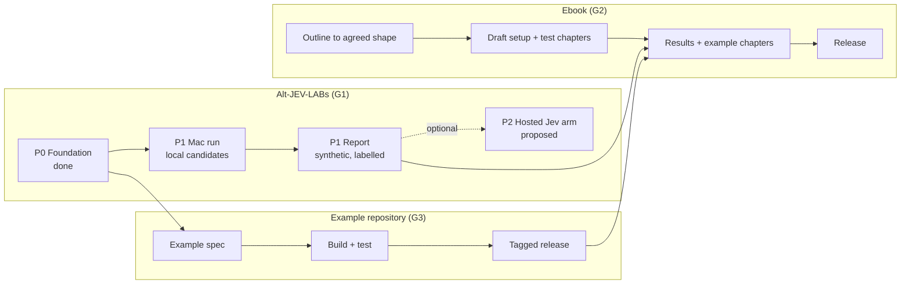

# Project plan: from goals to tasks

**Status: draft for owner approval (2026-10-05, `claude-cloud-ws1-01`).** This file organises decisions already made and maps them to the detailed trackers. It decides nothing new. Rows marked **proposed** are not adopted until the owner confirms (D31). Live status stays in the trackers linked below; this file holds the structure.

> **Private companion repositories.** The ebook text and the ebook's example code live in two private repositories, called here **the ebook workspace** and **the example repository**. Their addresses are deliberately not recorded in this public repository (owner instruction, 2026-10-05). Each of them records the mapping back to this repository's decisions and documents.

Detailed trackers:

| Repository | Tracker | Holds |
| --- | --- | --- |
| `lballaty/Alt-JEV-LABs` (this repo) | `docs/TRACKER.md`, `docs/STATUS_REVIEW.md` | Testing alternatives to Jev and reporting results |
| The example repository (private) | Its own tracker | The ebook's example code (D34) |
| The ebook workspace (private) | Its own handoff tracker | The ebook text |

## 1. Goals (owner intent, D33)

| Goal | What "done" means |
| --- | --- |
| **G1. Test alternatives to Jev and show the results** | Local candidates measured on the M4 Max on the same synthetic alert-triage cases, with a report that labels data as synthetic, states each latency's network path (D32) and cites Jev's published figures as third-party (D31) |
| **G2. Ebook in plain English** | A reader without technical background understands what to set up, how the testing works, how to read results, and how the example works; technical detail lives in the repos |
| **G3. Working example** | A small alert-triage example in the example repository that calls Jev or a local alternative and lets deterministic code decide the action, with tests and a tagged release the ebook can reference |

## 2. How the pieces fit

## 3. Phases and workstreams

### G1: lab (owner of code: `claude-cloud-ws1-01`; Mac hardware work: the Mac agent)

| Phase | Work item | Tracker ref | Owner | Status | Blocked by |
| --- | --- | --- | --- | --- | --- |
| P0 Foundation | Rubric 2.4.0 | WS2 | done | Frozen | - |
| P0 | Seed registry, reference-only seeds | WS1, WS5 | `claude-cloud-ws1-01` | Merged; license check partial | - |
| P0 | Cohort generator (560 cases) | WS3 | `claude-cloud-ws1-01` | Merged; LOSO, stream replay, label-budget subsets not built | - |
| P0 | Runner, scorecard, report | WS4 | `claude-cloud-ws1-01` | Merged; network-path field (D32) not built | - |
| P0 | Chat module (optional) | WS7 | `claude-cloud-ws1-01` | Merged, off by default | - |
| P0 | Jev source library | WS11 | `claude-cloud-ws1-01` | Done; research stopped | - |
| P1 Mac run | Choose candidates and storage | Q1-Q3, Q8 | Owner | Open | Owner |
| P1 | Latency budget, memory cap | Q4, D12 | Owner | Open | Owner |
| P1 | Page-now threshold: fixed 0.5 or tuned on validation | STATUS_REVIEW s7 | Owner | **Proposed** | Owner |
| P1 | Adapters retargeted to six routes and P1-P4; pin Laya revision; set Von/GLiClass options | WS8 | Mac agent (not yet registered) | Not started | Q1-Q3, Q8 |
| P1 | Model manager changes applied on the Mac | WS9 | `codex-ebook-companion-01` coordinates | Blocked on Mac | Mac |
| P1 | Network-path field and loopback timing in the runner | D32 | `claude-cloud-ws1-01` | Not built | Owner go-ahead |
| P1 | Run candidates on the test split | HANDOFF_MAC | Mac agent | Not started | WS8, Q4 |
| P1 | Report with published Jev figures labelled | Q10, D31 | `claude-cloud-ws1-01` + Mac agent | Not started | Run, Q10 |
| P2 | Hosted Jev arm on our cases (under USD 5) | STATUS_REVIEW s4 | - | **Proposed** | Owner approval, terms check |
| Optional | Realism research | WS10 | `codex-ebook-companion-01` | In progress | Network access |
| Optional | Real-data tooling | WS6 | - | Not started (D26: optional) | - |

### G3: example code (the example repository)

| Work item | Status | Blocked by |
| --- | --- | --- |
| Example specification: decision contract (from rubric 2.4.0), inputs, trusted context, actions, failure behaviour | Not started | Ebook shape (B1); implementation owner |
| Jev client using the official SDK | Not built | Spec; decision on whether we test the Jev path (key, spend) |
| Local alternative (proposed: a Jev-compatible local server so one client works for both) | Not built | Spec; candidate choice (Q3) |
| Deterministic policy layer: decides actions, refuses claims inside alert text, fails to a human | Not built | Spec |
| Tests and fresh-machine setup check | Not built | Code |
| Tagged release | Not built | Tests |
| **Implementation owner** | **Unassigned** | Owner |

### G2: ebook (`codex-ebook-companion-01`)

| Work item | Status | Blocked by |
| --- | --- | --- |
| B1 Outline to the agreed shape (proposed, section 4) | Realigned in the ebook workspace to setup and use (2026-10-05); awaiting owner approval | Owner approves outline |
| B2 Draft setup and test-design chapters | Not started | B1 |
| B3 Draft results-interpretation and worked-example chapters | Not started | P1 report; example release |
| B4 Release with pinned example-repository and lab versions | Not started | B3; publishing checks |

## 4. Proposed ebook shape (owner's direction 2026-10-05; to be recorded as a decision when confirmed)

| Part | Content | Detail lives in |
| --- | --- | --- |
| Setup | Enough plain-English explanation to understand what you install and why | Example repository |
| Test setup | What is tested, why it is fair, that the data is synthetic | Alt-JEV-LABs |
| Reading results | How to interpret the numbers and their limits | Alt-JEV-LABs reports |
| Worked example | The sample alert-triage implementation, step by step | Example repository |

Plain English throughout (D33): each technical term explained on first use; jargon stays in the repos.

## 5. Critical path

1. Owner answers Q1-Q4, Q8 and the threshold question, confirms the ebook shape, and assigns the example repository's implementation owner.
2. In parallel: Mac agent does WS8 and the run; the example is specified and built; ebook drafts setup and test-design chapters.
3. Report (P1) and example release feed the results and worked-example chapters.
4. Optional P2 hosted Jev arm if approved.

## 6. Open owner decisions (single list)

| # | Decision | Unblocks |
| --- | --- | --- |
| 1 | Candidates and storage (Q1-Q3, Q8) | WS8, run |
| 2 | Latency budget, memory cap (Q4) | Scorecard |
| 3 | Page-now threshold method | Fair scoring |
| 4 | Which published Jev figures to cite (Q10) | Report |
| 5 | Ebook shape (section 4) | B1, example spec |
| 6 | Example repository implementation owner | G3 |
| 7 | Test the example's Jev path (key, spend) or mark it unverified | G3 |
| 8 | Hosted Jev arm in P2 | P2 |
| 9 | `AGENTS.md` rule 6 edit | Agent instructions |
| 10 | Q11, Zenodo responses clause | Only if used |
