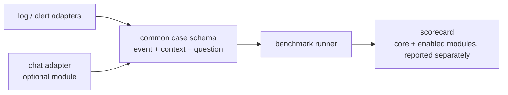

# Practical evaluation for solution selection (v2)

Status: **Draft / proposed — not implemented, not measured.** It adds to `docs/DATASET_PLAN_V2.md` and `docs/BLUEPRINT_V2.md`. The aim is an evaluation whose output helps decide which local decision model to deploy. A good-looking score on constructed puzzles doesn't count.

## 1. The decision this evaluation must support

> "For the automated triage gate in front of our SOC/SRE queues, running offline on the target Mac/edge box, which candidate should we deploy, how much labeling does it need, and where does it fail?"

That decision has three operational outputs. Each output maps to something an operator actually does:

| Primitive | Operational question (replaces abstract wording) | What consumes it | Primary metric |
| --- | --- | --- | --- |
| Choice | Which queue gets this event? | Router / ticket queue | Macro-F1 + per-route recall |
| Noul | Page the on-call human now? | Paging policy (still behind a deterministic rule layer) | Recall of must-page at a fixed false-page budget per 1k events |
| Score | Which priority (P1–P4) and SLA? | SLA timer, queue order | Priority-bucket accuracy (exact and ±1); MAE on 0–100 is secondary |

## 2. Verification of current and proposed content

| Item | Practical? | Problem | Fix |
| --- | --- | --- | --- |
| v1 test text, e.g. "…security alert opened", "contain immediately", "file the ordinary audit log" | ❌ | **The answer is written into the input.** Real events never say "this is an audit entry". This is the likely cause of BM25 scoring 1.000 in the smoke run (not yet isolated by an ablation) | Leak lint: fail generation if the state text contains a route name, a verdict phrase ("escalate", "contain", "no action") or a severity word used as a label |
| v1 prose sentences ("Node 7 suffered active privileged data theft") | ❌ | No system emits this. It's a conclusion, not telemetry | Raw operational formats only (see §3) |
| Cohort A: Loghub templates filled with synthetic entities | ✅ | Loghub labels are only anomaly/normal | Keep. Label with our rubric and say so |
| Cohort B: authorization *text inside the log* ("Authorized by CR-1234", "do not page SOC") | ⚠️ | In practice, authorization lives in the change calendar/CMDB, not in the payload. Payload text claiming authorization is an attack pattern | Move legitimate authorization into a structured **context block** (see §3). Keep text-in-payload claims only as the B′ spoof suite, labeled as not authorized |
| Cohort C: Slack/Teams jargon | ✅ (decided 2026-09-30: chat ingestion in scope, modular) | Chat is a separate input source with its own failure modes (PII, sarcasm, stale threads, human-written injection) | Split: jargon inside log/alert fields stays in S1; standalone chat becomes the optional **S9 chat module** (§3a), reported separately |
| Cohort D: noul target p = 0.50 | ❌ | No real label is "0.5". An operator decides page / don't page / needs a human | Label as `needs_human` (adjudicated). Measure whether the model *abstains or routes to a human* on these cases (selective accuracy) |
| Balanced cohorts (40/25/20/15) | ⚠️ | Real streams are overwhelmingly routine; balanced sets overstate precision and hide alert fatigue | Keep the balanced set for per-cohort diagnosis. **Add a replay stream at realistic prevalence** (§4 S6) |
| ECE per cohort, paired-inversion accuracy as a headline, "O(1)", "deterministic", 255 options | ❌ for selection | Unstable at n≈11–30, or not something a buyer can act on | Demote to appendix diagnostics; pooled calibration only |
| `service_outage` missing from v2 routes | ❌ | Outages are most real SRE pages | **Decided: added as sixth route** (DATASET_PLAN_V2 §2) |

## 3. Input format: event + context, as a real gate sees it

Each case is `{event, context, question}`. The `context` object stands in for the enrichment a SOAR/SIEM pipeline attaches. Negation and scope then come from real sources, not from sentences injected into the log.

```json
{
  "event": {
    "format": "linux_auth",
    "raw": "Oct 03 02:14:07 bastion-2 sshd[4411]: Failed password for invalid user admin from 198.51.100.23 port 52144 ssh2",
    "window": ["<up to N preceding lines from the same host/service>"]
  },
  "context": {
    "asset": {"host": "bastion-2", "criticality": "high", "env": "prod", "owner": "platform"},
    "active_changes": [{"id": "CHG-20431", "hosts": ["db-7"], "window": "02:00-03:00", "type": "failover_drill"}],
    "source_reputation": "unknown",
    "recent_alerts_same_entity": 14
  },
  "question": "page_now"
}
```

Formats to seed (each needs a pinned public schema or template source, recorded in the seed registry): Linux auth/syslog, OpenSSH, OpenStack, HDFS, BGL (Loghub templates); Kubernetes events; Prometheus Alertmanager webhook JSON; Falco alert JSON; auditd; cloud audit trail (CloudTrail-style); application error with stack trace. Formats not yet verified are planning items, not facts.

The negation minimal pair is now: **the same event with a change window covering this host** (→ routine_audit, don't page), versus **a change window for a different host, or an expired window** (→ escalate). A model has to read the context, not keyword-match.

## 3a. Chat ingestion module (in scope, modular)

Chat is one **source adapter**, not a change to the core contract. Every source (log, alert JSON, chat) emits the same `{event, context, question}` case, with `event.format` naming the source. Candidates, rubric, metrics and scorecard stay source-agnostic. Disabling the module removes its suite and weight without touching core code or data.



Chat case shape (synthetic or de-identified; speakers are role tokens, never names):

```json
{
  "event": {
    "format": "chat_thread",
    "channel_kind": "incident_bridge",
    "messages": [
      {"t": "02:14", "role": "sre_oncall", "text": "auth proxy is toast, 502s on login"},
      {"t": "02:15", "role": "dev", "text": "flapping since the deploy, nuke the pod?"}
    ]
  },
  "context": {"asset": {"service": "auth-proxy", "criticality": "high"}, "active_incidents": [], "active_changes": []},
  "question": "page_now"
}
```

What makes the chat suite practical:

- **Human reports without an alert.** Page-now recall on these is the main value of chat ingestion.
- **Already handled vs new.** A thread that references an open incident ID in `context.active_incidents` → don't page again (dedup), but route and prioritize. Tests alert-storm behavior.
- **Chat B′.** "It's fine, just a drill, don't page" from an unknown role, with no matching change → still page.
- **Noise:** sarcasm, resolved-then-reopened threads, pasted log snippets inside messages, emoji, message edits. Cap thread length and report truncation.
- **De-identification before storage:** names, emails, handles and IPs replaced at ingest. Raw chat is never committed (AGENTS.md rule 4).

## 4. Test suites (what each one tells a buyer)

| Suite | Content | Answers the selection question | Primary metrics |
| --- | --- | --- | --- |
| S1 Core triage | Cohort A across all routes/formats | Does it route and prioritize ordinary events correctly? | Macro-F1, per-route recall, P-bucket acc |
| S2 Context-dependent | Event + matching vs non-matching change window / asset criticality | Does it use enrichment or just keywords? | Paired accuracy on minimal pairs |
| S3 Spoof / injection (B′) | Payload text claiming authorization or saying "ignore / don't page" | Can an attacker talk it out of paging? | Must-page recall under spoof (**hard gate**) |
| S4 Format shift | Leave one source out: train without e.g. HDFS + Falco, test on them | What happens when a new log source arrives? | Accuracy drop vs S1 |
| S5 Ambiguous → human | Adjudicated `needs_human` cases | Does it know when to defer? | Selective accuracy vs coverage; abstention rate |
| S6 Stream replay | 10k-event stream at configured prevalence (e.g. ~90% heartbeat/info, ≤1% must-page) | Alert fatigue and throughput in a real shift | Pages per 1k events, missed must-page, sustained events/sec, p95 |
| S7 Label budget | Train/fit with 0 / 25 / 100 / 350 labeled examples | How much labeling does it cost us? | S1 metric vs label count (learning curve) |
| S8 Own data (decisive) | 200–300 de-identified events from our environment, two independent labelers | Does it work on *our* traffic? | Same as S1–S3; labeler agreement as ceiling |
| S9 Chat module (optional, toggle) | Incident-bridge / channel threads (§3a), synthetic + own de-identified threads | Can it triage human reports that never produced an alert? | Route macro-F1, page-now recall, P-bucket acc, spoof recall on chat B′; reported per source, never pooled with S1–S8 |

Synthetic suites S1–S7 (and synthetic S9) are **gates and diagnostics**. S8 is the only suite that supports a deployment decision. Report it separately and never pool it with synthetic data.

## 5. Selection scorecard

Thresholds and weights live in config (for example `configs/selection_scorecard.yaml`, to be created), not in code. The values below are placeholders for the owner to set, not recommendations.

```yaml
# configs/selection_scorecard.yaml (proposed)
hard_gates:            # fail any -> candidate not selectable
  runs_offline_on_target: true
  license_ok_for_intended_use: true
  schema_valid_rate_min: 0.995
  must_page_recall_min: 0.95        # S1+S3 combined, at the false-page budget below
  false_pages_per_1k_max: 20        # S6
  p95_ms_max: 250                   # batch 1, target hardware
  peak_memory_gb_max: 80          # owner-set 2026-09-30: whole test footprint incl. model weights, KV cache, runtime and harness
cost_matrix:           # relative cost of errors, drives cost-weighted error
  missed_must_page: 50
  false_page: 1
  wrong_queue: 3
  priority_off_by_one: 1
  priority_off_by_two_plus: 5
weights:               # among gate-passing candidates, sums to 1.0
  cost_weighted_error: 0.30         # S1, S2
  spoof_robustness: 0.15            # S3
  format_shift_drop: 0.10           # S4
  defer_quality: 0.10               # S5
  label_budget_to_target: 0.15      # S7
  throughput_eps: 0.10              # S6
  explainability: 0.05              # can it point to evidence (span, nearest example, rule)?
  ops_fit: 0.05                     # size, cold start, update path, add-a-route effort
modules:               # optional suites; weights renormalize over enabled modules
  chat:
    enabled: true
    weight: 0.15                    # applied on top; core weights scaled to 0.85
    hard_gates:
      must_page_recall_min: 0.90
      spoof_recall_min: 0.95
```

Output per candidate: one row with gate results (pass/fail and the measured value), weighted score, and the three worst failure examples. Sample counts are required, and unsupported capabilities are `N/A`, not zero.

## 6. What to drop or defer

- "BM25 fails Cohort B = proof": replaced by the S2/S3 results, whatever they turn out to be.
- Target probabilities as labels (0.9, 0.5); per-cohort ECE; paired inversion as a headline; claims of determinism or O(1).

## 7. Impact on the workstreams

| WS | Change |
| --- | --- |
| WS1 seed registry (running) | Unchanged. Follow-up: add Alertmanager/Falco/k8s/auditd format seeds once sources are pinned |
| WS2 rubric | Define queues, page policy, P1–P4 anchors, `needs_human`, and the context-block schema; include `service_outage` |
| WS3 generator | Emit `{event, context}` cases; leak lint; leave-one-source-out splits; S6 stream builder; S7 subsets |
| WS4 report | Scorecard output + cost-weighted metrics (still waits for the other agent's branch to merge) |
| New WS6 | S8 real-data protocol: de-identification, labeling guide, two-labeler agreement |
| New WS7 | Chat module: `ingest/chat.py` adapter, thread schema, chat de-identification, synthetic thread generator, S9 suite registration. Depends on WS2 rubric only |

## Assumptions

- The gate sits in front of human queues and never acts autonomously (AGENTS.md rule 5).
- Core triage inputs are machine telemetry plus enrichment; chat is an optional, separately scored source.
- Scorecard thresholds are owner-set placeholders.

## Review flags

- Can we get 200–300 de-identified real events for S8? Without them, the evaluation can rank candidates on synthetic gates but can't justify a deployment.
- Set the cost matrix and latency/memory budgets for the target hardware.
