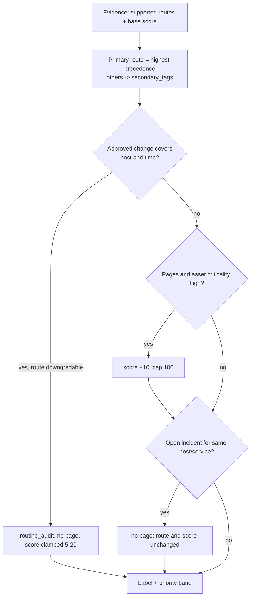

# v2 labeling rubric

Status: **Draft (`2.0.0-draft`), not frozen.** Machine-readable source: `configs/domains/v2_rubric.json`. Implementation: `data/rubric.py`. Tests: `tests/test_rubric.py`. This file explains the rubric; if the two disagree, the JSON wins and this file is a bug.

This rubric labels a synthetic benchmark fixture. It is not a production paging or containment policy, and model output never authorizes action (AGENTS.md rule 5).

## Routes and defaults

| Route | Queue | Pages by default | Default score | Typical priority |
| --- | --- | --- | --- | --- |
| `security_escalation` | SOC | yes | 75–95 | P1/P2 |
| `data_sovereignty_flag` | Privacy/DPO | no | 55–75 | P2/P3 |
| `service_outage` | SRE on-call | yes | 70–95 | P1/P2 |
| `policy_exception` | Platform/compliance review | no | 30–55 | P3 |
| `routine_audit` | Audit log | no | 5–20 | P4 |
| `telemetry_heartbeat` | Metrics only | no | 0–10 | P4 |

Priority bands: P1 ≥ 80, P2 ≥ 60, P3 ≥ 30, P4 ≥ 0.

## How a label is computed

Precedence: security → data sovereignty → outage → policy exception → routine audit → heartbeat. Security comes first because an adversary may still be active; sovereignty second because notification clocks can start (e.g. GDPR Art. 33).

## Rules that make the test practical

- **Authorization comes only from `context.active_changes`.** The change must be `approved`, list the event host, and cover the event time (timezone-aware ISO-8601). A change for a different host, an expired change or an unapproved change does not downgrade.
- **Payload wording is ignored.** "Authorized by CR-1234", "drill in progress" or "do not page SOC" inside the event text changes nothing. These are the B′ spoof cases.
- **Dedup.** An open incident for the same host or service suppresses a second page. Route and priority stay the same.
- **Ambiguous cases** carry `adjudication: needs_human` and `page_now: null`. They are scored on abstention/deferral, not accuracy.
- **Leak lint.** Generated event text may not contain route names or verdict phrases ("escalate now", "no action needed", "page the on-call"). The B′ cohort is exempt. Upstream severity fields (e.g. Alertmanager `severity: critical`) are real source signals and are allowed.

## Before freezing

- Independent review of route definitions and precedence by someone who triages SOC/SRE queues.
- Set `status` to `frozen` and bump the version. Record the version in every dataset manifest and report.
